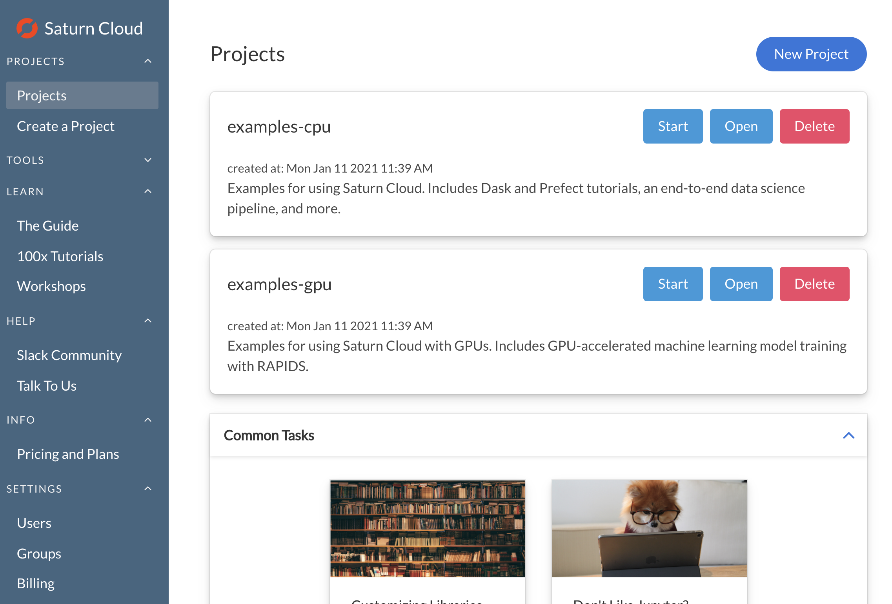
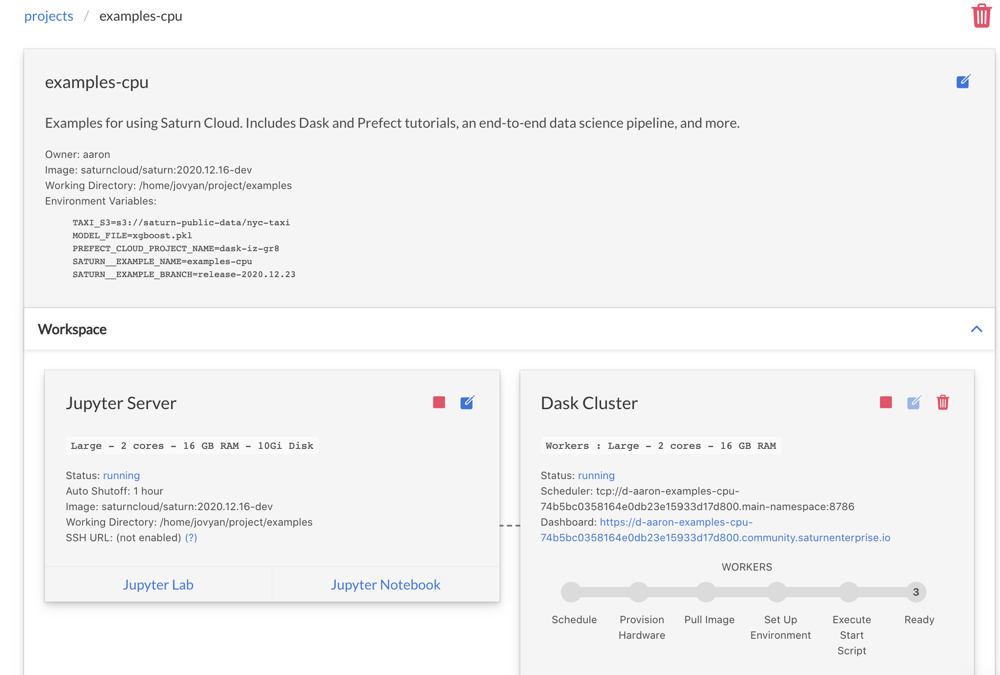
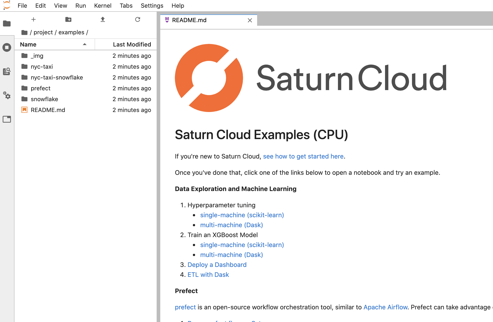

# Examples

Example projects for getting started with Saturn Cloud. These examples are pre-populated for each user account in all Saturn Cloud installations, so the best place to experience them is by running the projects in your Saturn Cloud installation. If you do not have access to Saturn Cloud, you can [get started with a free account](https://www.saturncloud.io/docs/getting-started/).

## Getting Started

Once you have a Saturn Cloud account, the example projects will be available on the "Projects" page. Click "Start" on one of the projects to spin up the Jupyter Server and Dask cluster.



Once the Jupyter Server is running, click "Jupyter Lab" to open up Jupyter Lab. 



The readme for the example project will be opened up and you can take it from there!



## Update example projects

If you delete an example project or would like the latest version, navigate to the "Projects" page and click "Set up example projects". This will set up the projects again in your account with the latest code from this repository.

## Running in a new project

These examples are configured to run with small data sizes to quickly (and cost-effectively) illustrate the features of Saturn Cloud. If you prefer to run these examples in a new project, or would like to modify the code and run with larger data sizes and clusters, you can clone the repo by opening a new Terminal within the JupyterLab of your project, then copying the example you want into the `/home/jovyan/project` folder:

```bash
git clone https://github.com/saturncloud/examples.git /tmp/examples
cp -r /tmp/examples/examples/examples-gpu /home/jovyan/project/
```

## Contributing

Each example in the `examples/` directory is used to pre-populate a Saturn Cloud project in installations of Saturn Cloud. For details on the structure and guidance on how to edit or add examples, see [the contributing guidelines](./CONTRIBUTING.md).
