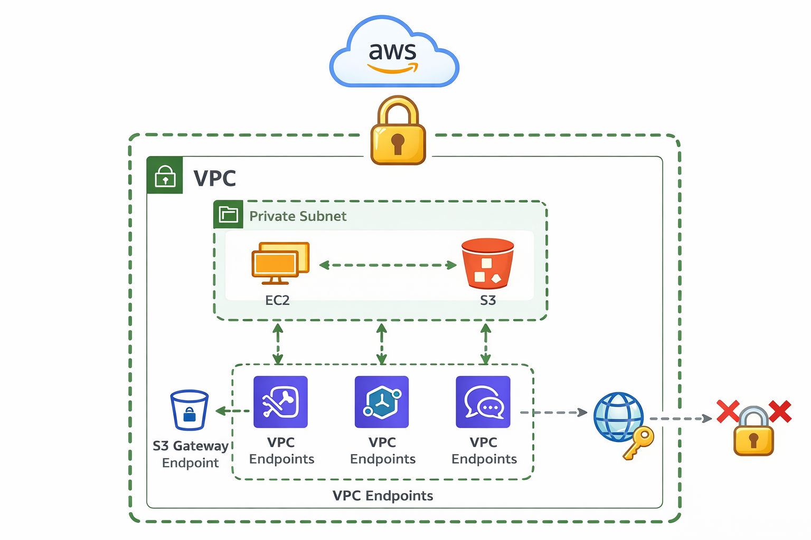

# 🔒 Private Data Access (VPC Only)

**Hardware:** CPU (Amazon Linux 2023) | **Resource:** Dashboard | **Tech Stack:** AWS SDK (Python/Boto3), Streamlit | **Architecture:** VPC-Only S3 Mounts



## 📖 Overview

This template deploys a secure, airgapped S3 Data Gateway inside an isolated AWS environment. It reads data strictly from a local Mountpoint for Amazon S3 and queries AWS health metrics via VPC Endpoints. It is designed to be accessed purely through an encrypted AWS Systems Manager (SSM) tunnel, bypassing the public internet entirely.

## ✅ Prerequisites

Ensure the AWS environment is already configured with the following:

* **The Network:** A private VPC subnet containing an Amazon Linux 2023 EC2 instance, with **no** Internet Gateway (IGW) or NAT Gateway attached.
* **VPC Endpoints:** An S3 Gateway Endpoint and SSM Interface Endpoints (`ssm`, `ssmmessages`, `ec2messages`) attached to your VPC.
* **IAM & Security:** The EC2 instance has an IAM Role attached with `AmazonSSMManagedInstanceCore` and S3 permissions.
* **Local Machine:** Your local terminal has the AWS CLI configured and the **AWS Session Manager Plugin** installed.

Note: **AWS_Setup.md** contains step by step procedure to set this environment up.

---

## 📦 Step 1: The "Airgap Bypass" (Dependency Smuggling)

Because your target EC2 instance has no internet access, standard `pip install` commands will fail. You must package the Python dependencies on your local machine and transfer them to the server via your S3 bucket.

**1. Download the Linux Packages Locally**
Open a terminal on your **local, internet-connected machine** and run these commands to force `pip` to download the specific Amazon Linux (`manylinux`) offline installers:

```bash
mkdir sm_packages_linux
pip download --only-binary=:all: --platform manylinux2014_x86_64 --python-version 39 streamlit boto3 -d sm_packages_linux
zip -r sm_packages_linux.zip sm_packages_linux

```

**2. Upload to S3**

* Navigate to the **AWS S3 Console** in your web browser.
* Upload the `sm_packages_linux.zip` file directly to the root of your target S3 bucket.

---

## 🚀 Step 2: Automated Server Deployment

Connect to your airgapped EC2 instance via **AWS Systems Manager (SSM) Session Manager** in the AWS Console.

Instead of running commands one by one, we will use an automated deployment script.

**1. Create the Deployment Script**
In your EC2 terminal, create a new script file:

```bash
nano deploy_dashboard.sh

```

**2. Paste the Automation Code**
Paste the code below into the file. **CRITICAL: Update the `YOUR_BUCKET_NAME` and `eu-north-1` variables at the very top of the script to match your environment!**

```bash
#!/bin/bash

# ==========================================
# CONFIGURATION (UPDATE THESE VARIABLES!)
# ==========================================
BUCKET_NAME="YOUR_BUCKET_NAME"
REGION="eu-north-1"
# ==========================================

MOUNT_DIR="/mnt/s3-data"
ZIP_FILE="sm_packages_linux.zip"

echo "🚀 Starting Airgapped Dashboard Deployment..."

echo "📁 Creating mount directory and installing mount-s3..."
sudo mkdir -p $MOUNT_DIR
sudo chmod 777 $MOUNT_DIR
sudo dnf install mount-s3 -y

echo "🔗 Mounting S3 bucket..."
mount-s3 $BUCKET_NAME $MOUNT_DIR

echo "🐍 Installing Python pip..."
sudo dnf install python3-pip -y

echo "📦 Extracting smuggled dependencies..."
cd ~
cp $MOUNT_DIR/$ZIP_FILE .
unzip -o $ZIP_FILE

echo "⚙️ Installing Python packages offline..."
python3 -m pip install --user --no-index --find-links=sm_packages_linux/ streamlit boto3

echo "📝 Generating app.py..."
cat << EOF > app.py
import streamlit as st
import os
import boto3

MOUNT_PATH = "${MOUNT_DIR}"
BUCKET_NAME = "${BUCKET_NAME}"
REGION = "${REGION}"

st.set_page_config(page_title="Secure VPC Dashboard", layout="wide")
st.title("🔒 Airgapped S3 Data Gateway")
st.markdown("This dashboard runs securely inside a private VPC, completely isolated from the public internet.")

col1, col2 = st.columns(2)

with col1:
    st.header("📁 Local S3 Mount Viewer")
    try:
        files = os.listdir(MOUNT_PATH)
        st.success(f"Connected to mount: \`{MOUNT_PATH}\`")
        if files:
            for file in files:
                st.write(f"📄 {file}")
        else:
            st.info("The bucket is currently empty.")
    except Exception as e:
        st.error(f"Mount read error. Error: {e}")

with col2:
    st.header("📡 AWS SDK Health Monitor")
    try:
        s3_client = boto3.client('s3', region_name=REGION)
        response = s3_client.list_objects_v2(Bucket=BUCKET_NAME, MaxKeys=5)
        st.success("✅ VPC Endpoint Connection Active")
        
        if 'Contents' in response:
            st.write("**Recent Objects via SDK:**")
            for obj in response['Contents']:
                st.write(f"☁️ \`{obj['Key']}\` ({round(obj['Size'] / 1024, 2)} KB)")
        else:
            st.info("No objects found via SDK.")
    except Exception as e:
        st.error(f"VPC Endpoint connection failed. Error: {e}")
EOF

echo "🎉 Deployment complete! Starting Streamlit server..."
/home/ssm-user/.local/bin/streamlit run app.py

```

*(Save the file: Press `Ctrl+O`, `Enter`, then `Ctrl+X`).*

**3. Run the Script**
Make the script executable and run it. It will automatically handle the S3 mounts, offline installations, Python code generation, and will launch the server directly!

```bash
chmod +x deploy_dashboard.sh
./deploy_dashboard.sh

```

*(Leave this terminal open and running once it says it is waiting on port 8501!)*

---

## 🚇 Step 3: Access the Dashboard (Local Tunnel)

Your dashboard is now running, but it is trapped inside the airgapped VPC.

**1. Open the Encrypted Tunnel**
Open a terminal on your **local machine** and run the following command to securely forward the traffic. *(Replace `TARGET_INSTANCE_ID` and `YOUR_REGION` with your actual EC2 details)*:

```bash
aws ssm start-session \
    --target TARGET_INSTANCE_ID \
    --document-name AWS-StartPortForwardingSession \
    --parameters "portNumber"=["8501"],"localPortNumber"=["8501"] \
    --region YOUR_REGION

```

**2. View the Interface**
Once your local terminal says `Port 8501 opened for sessionId... Waiting for connections...`, open a web browser on your local machine and strictly navigate to the **HTTP** address (Do not use HTTPS):

```text
http://localhost:8501

```

🎉 **Your Secure Airgapped Dashboard is now live!**

---

*Built with [Saturn](https://saturncloud.io) — Explore more templates and secure deployments.*

---
