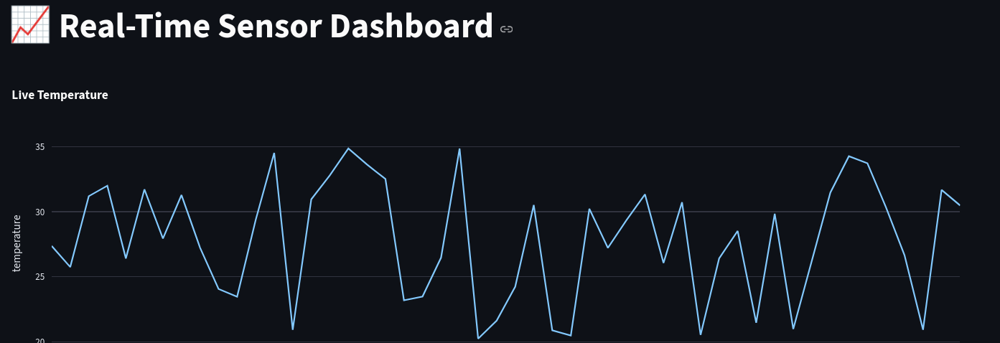

# 📈 Real-Time Streaming Dashboard (Kafka + Streamlit)

A high-performance template for building live data visualizations using **Apache Kafka** and **Streamlit**. This project demonstrates a complete streaming lifecycle: from synthetic data generation to real-time graphical monitoring within a [Saturn Cloud Job](https://saturncloud.io/).

---



## 🚀 Overview

This template utilizes **Kafka in KRaft mode**, eliminating the need for ZooKeeper and allowing the entire broker to run locally within your compute resource. It is designed for developers learning to bridge the gap between backend event streams and frontend interactive dashboards.

### Key Features

* **Local KRaft Broker**: Integrated Kafka 3.9.1 server running as a background daemon.
* **Synthetic Producer**: Continuous event generation simulating live sensor telemetry.
* **Stateful Dashboard**: Streamlit UI using `st.rerun()` and `st.cache_resource` for smooth, non-blocking data updates.
* **Fault Tolerant**: Persistent history tracking via Streamlit's `session_state`.

---

## 📂 Project Structure

```text
├── app.py              # Streamlit dashboard (Consumer)
├── producer.py         # Synthetic data generator (Producer)
├── env-setup.sh        # Environment & Kafka initialization script
├── run_template.sh     # Master orchestration script
├── requirements.txt    # Python dependencies
└── kafka/              # Local Kafka binaries (Created during setup)

```

---

## ⚙️ Setting Up on [Saturn Cloud](https://saturncloud.io/)

### 1. Initialize the Environment

Run the setup script to install Java (OpenJDK 11), download Kafka, and configure the Python virtual environment. This script automatically clears old metadata to prevent `Cluster ID` mismatches.

```bash
chmod +x env-setup.sh
./env-setup.sh

```

### 2. Launch the Pipeline

Execute the master script to start the Broker, Producer, and Dashboard. This script automatically handles **sourcing the virtual environment** before execution.

```bash
chmod +x run_template.sh
./run_template.sh

```

### 3. Access the Dashboard

Because this runs as a **Job**, you must establish an SSH tunnel from your local machine to view the UI:

```bash
# On your local computer
ssh -L 8000:localhost:8000 root@<YOUR_JOB_IP>

```

Visit `http://localhost:8000` in your browser.

---

---

## 🛑 Managing the Lifecycle

### Stopping Background Processes

To stop the dashboard and background daemons safely, use the following commands:

1. **Stop Dashboard**: `Ctrl + C` in the running terminal.
2. **Stop Producer**: `pkill -f producer.py`
3. **Stop Kafka Broker**: `./kafka/bin/kafka-server-stop.sh`

### Full Restart

If the broker crashes or you experience "Connection Refused" errors, perform a **hard reset**:

```bash
# 1. Kill all related processes
pkill -9 python && pkill -9 -f kafka
# 2. Run the environment setup again to clear metadata
./env-setup.sh
# 3. Start the template
./run_template.sh

```

---

## 🌐 Transitioning to Remote Kafka

While this template uses a local broker, it can easily be adapted for remote services like **Confluent Cloud** or **Amazon MSK**.

**1. Configuration Changes:**
In both `app.py` and `producer.py`, replace `localhost:9092` with your remote broker endpoint and add your credentials:

```python
conf = {
    'bootstrap.servers': 'your-remote-broker:9092',
    'security.protocol': 'SASL_SSL',
    'sasl.mechanisms': 'PLAIN',
    'sasl.username': 'YOUR_API_KEY',
    'sasl.password': 'YOUR_API_SECRET'
}

```

**2. Startup Procedure for Remote:**
When using a remote broker, you skip the local Kafka startup steps:

```bash
# Activate your virtual environment
source env/bin/activate

# Start the Producer to send data to the cloud
python producer.py &

# Launch the Dashboard
python -m streamlit run app.py --server.port 8000 --server.address 0.0.0.0

```

**3. Observing the Stream:**
Observation remains the same as the local version:

* Establish your **SSH Tunnel** to the Saturn Cloud Job on port `8000`.
* Open your browser to `http://localhost:8000`.
* The dashboard will now reflect data being pulled from your **Remote Cloud Topic** instead of the local disk.

---