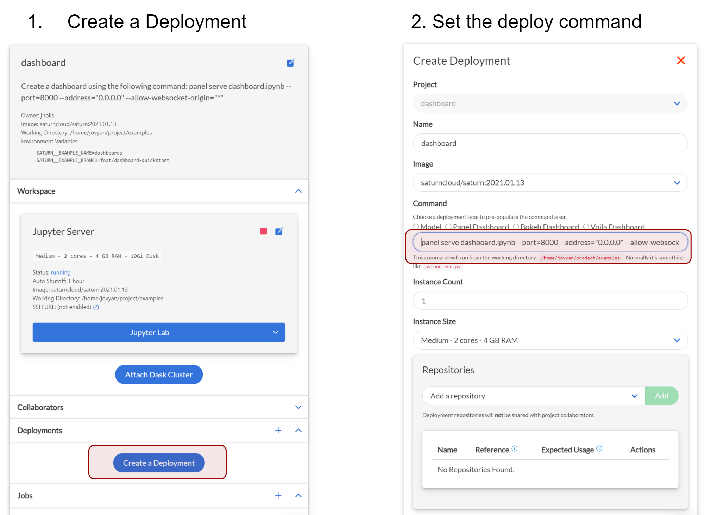
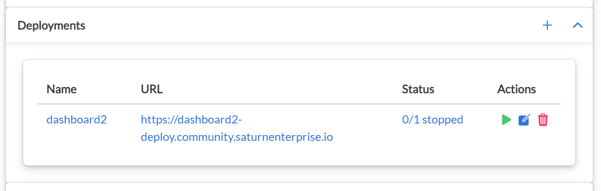

# Deploying a dashboard with Saturn Cloud

This example shows how to deploy a dashboard with Saturn Cloud. The example dashboard, located in [dashboard.ipynb](dashboard.ipynb), uses the Panel library to layout data visualizations involving New York Taxis. To deploy the dashboard to Saturn Cloud so that it's continuously viewable, follow the steps below. And note that while we used Panel for this demo, other dashboarding tools like Dash or even APIs can be deployed to Saturn Cloud

## Deploying the example

To deploy, use this for the command go back to your project page (where you started the jupyter server). From there you can click "Create a Deployment" and use the following command:

```bash
panel serve dashboard.ipynb --port=8000 --address="0.0.0.0" --allow-websocket-origin="*"
```

The command let's Saturn Cloud know how it should make the deployment visible to the public--in this case serve it as a panel. In other situations you might want to use other commands, such as if you're running an API.

</img>

Once the deployment is created, use the green triangle to start it. It may take several minutes to start. Once it is started, click the URL to see the dashboard--and that URL can be shared with others!

</img>