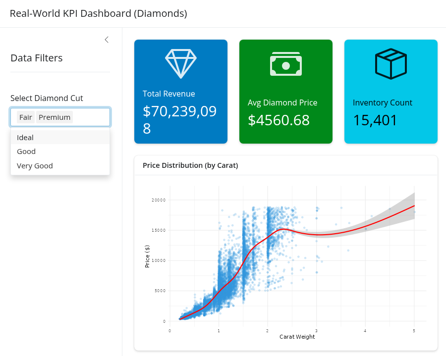

### **README.md**

# 📊 R Shiny KPI Dashboard

<div align="center">

</div>

### **Overview**

This template provides a professional-grade executive dashboard built for **R Server** environments. Optimized for **CPU resources**, it demonstrates high-efficiency data aggregation and reactive visualization. The "3-tile" architecture is designed to provide immediate clarity on Key Performance Indicators (KPIs), transforming complex datasets into actionable business insights through a clean, modern interface.

### **Dataset Overview**

The template utilizes the **Diamonds** dataset (built into the Tidyverse), which contains the physical attributes and prices of over 54,000 diamonds. This dataset is used to calculate critical retail KPIs, including **Total Revenue**, **Average Price**, and **Inventory Volume**, filtered by the quality of the diamond cut.

### **Tech Stack**

* **R**: The core statistical engine used for data processing.
* **Shiny**: The reactive web framework that powers the interactive dashboard elements.
* **Tidyverse**: Utilized for efficient data manipulation (`dplyr`) and high-quality plotting (`ggplot2`).
* **bslib/bsicons**: Provides the Bootstrap 5 styling for the KPI "value boxes" and professional iconography.

---

## 🛠️ Local Setup Instructions (Linux/Kali)

### 1. Install System Dependencies

Before running the R packages, ensure your Linux system has the required development headers:

```bash
sudo apt update && sudo apt install -y libcurl4-openssl-dev libssl-dev libxml2-dev libfontconfig1-dev libfreetype6-dev libpng-dev libtiff5-dev libjpeg-dev libharfbuzz-dev libfribidi-dev

```
### 2. Install R Libraries

Open your RStudio console and run:

```r
install.packages(c("shiny", "tidyverse", "bslib", "bsicons"))

```

### 3. Launch the Dashboard

1. Open `app.R` in RStudio.
2. Click the **"Run App"** button at the top of the editor.

---

## 📈 Dashboard Features

* **Key Performance Tiles**: Instant summary of Revenue, Avg Price, and Count.
* **Dynamic Sidebar**: Multi-select filters for diamond quality (Cut) that update the entire UI in real-time.
* **Trend Analysis**: Scatter plot with a smoothed trend line to visualize the relationship between carat weight and price.

---

## 🔗 Resources and Support

* **Platform**: [Saturn Cloud R Documentation](https://saturncloud.io/docs/)
* **Library**: [Shiny Official Gallery](https://shiny.posit.co/r/gallery/)
* **Library**: [Tidyverse Documentation](https://www.tidyverse.org/)

---