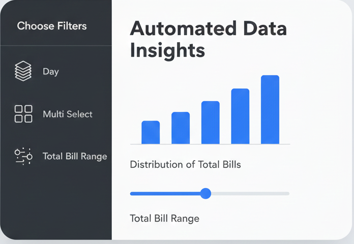

# 🚀 Streamlit EDA Dashboard

<div align="center">
  
</div>

### **Overview**
This template provides a rapid deployment setup for a web-based Exploratory Data Analysis (EDA) tool. Designed for **CPU resources**, it allows you to transform a local Python environment into a functional analytics dashboard. The primary goal is to provide a "One-click profiler" that automates data inspection, statistical summaries, and distribution plotting through an intuitive browser interface.

### **Dataset Overview**
The template utilizes the **Tips** toy dataset, which contains records of restaurant bills, tip amounts, and demographic data such as the day of the week and time of day. It is an excellent dataset for demonstrating the power of categorical filtering and numerical profiling in an automated dashboard environment.

### **Tech Stack**
* **Python**: The core logic layer for data processing and app execution.
* **Pandas**: Manages the underlying data frames and performs statistical profiling calculations.
* **Streamlit**: The primary framework used to build the interactive UI and handle real-time visualization updates.

---

## 🛠️ Local Setup Instructions

### 1. Create and Activate Virtual Environment
Open your terminal on your host machine and execute the following:
```bash
# Create environment
python -m venv streamlit_env

# Activate (Windows)
streamlit_env\Scripts\activate

# Activate (macOS/Linux)
source streamlit_env/bin/activate

```

### 2. Install Dependencies

```bash
pip install streamlit pandas matplotlib seaborn

```
or 

```bash
pip install -r requirements.txt

```

### 3. Run the Dashboard

```bash
streamlit run app.py

```

---

## 🔗 Resources and Support

* **Dashboard Platform**: [Streamlit Cloud](https://streamlit.io/cloud)
* **Library**: [Streamlit Documentation](https://docs.streamlit.io/)
* **Library**: [Pandas API Reference](https://pandas.pydata.org/docs/)

---