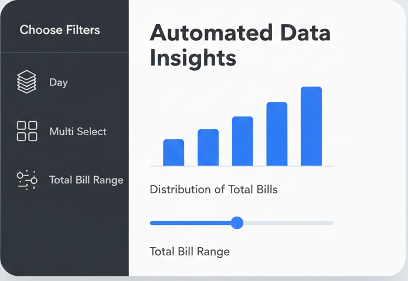

# 📊 Streamlit EDA Dashboard

<div align="center">
  
</div>

### Overview
This template deploys a browser-based **Exploratory Data Analysis (EDA)** dashboard built with Streamlit on Saturn Cloud. It gives you instant statistical profiling, interactive filtering, and distribution charts — all without writing a single line of code.

The app ships with the built-in **Tips** dataset so it works the moment you start it. When you're ready to analyse your own data, simply upload any CSV file directly from the browser and the dashboard immediately re-profiles it.

---

## ✨ What the App Does

| Feature | Description |
|---|---|
| **CSV file uploader** | Drag and drop any CSV file in the sidebar to replace the default dataset |
| **Auto-detect columns** | Filters and chart options populate automatically based on your data's columns |
| **Categorical filters** | Pick any text/category column to slice the data by its unique values |
| **Statistical summary** | Instant count, mean, std, min/max, and percentiles for all numeric columns |
| **Raw data preview** | Shows the first 10 rows of your filtered dataset |
| **Distribution chart** | Select any numeric column to plot a histogram with a density curve |
| **Default dataset** | Falls back to the Tips dataset when no file is uploaded |

---

## 📁 Uploading Your Own Data

### Supported Format
- **CSV files only** (`.csv`)
- UTF-8 encoding recommended
- First row must be the column headers

### What Makes a Good Dataset for This App

Your CSV should have at least:
- **One categorical column** (text values like names, categories, labels) — used to power the sidebar filter
- **One numeric column** (integers or decimals) — used to generate the distribution chart and statistics

The more columns your CSV has, the more the app gives you to explore — you can switch between any of them using the dropdowns.

### Good Examples to Try

| Dataset type | Categorical columns | Numeric columns |
|---|---|---|
| Sales data | Region, Product, Sales Rep | Revenue, Units Sold, Discount |
| HR / employee data | Department, Job Title, Gender | Salary, Age, Years at Company |
| Survey results | Country, Response, Category | Score, Rating, Count |
| E-commerce orders | Status, Category, Payment Method | Price, Quantity, Delivery Days |
| Sensor / IoT readings | Location, Device, Status | Temperature, Pressure, Voltage |

### What to Avoid
- **Very wide CSVs** (100+ columns) — the app handles them but dropdowns get crowded
- **Purely numeric CSVs** (no text columns) — the categorical filter won't have anything to work with
- **Large files over ~100MB** — the app will load them but may feel slow in the browser
- **Nested or multi-header CSVs** — the app expects a flat, single-header structure

### How to Upload
1. Open the app URL in your browser
2. In the **left sidebar**, find the **📂 Data Source** section
3. Click **"Browse files"** or drag and drop your CSV onto the uploader
4. The dashboard instantly re-renders with your data — no refresh needed
5. Use the **Filter by column** dropdown to pick a categorical column to slice by
6. Use the **Select column to visualize** dropdown in the chart section to switch between numeric columns

---

## 🛠️ Tech Stack

| Library | Role |
|---|---|
| **Streamlit** | Interactive web app framework — handles the UI, file uploader, widgets, and layout |
| **Pandas** | Data loading, filtering, and statistical profiling |
| **Seaborn** | Distribution chart rendering and default Tips dataset |
| **Matplotlib** | Chart rendering backend used by Seaborn |

---

## 🚀 Deploying on Saturn Cloud

This template includes a `.saturn/saturn.json` recipe that configures everything automatically. When you create a deployment from this template on Saturn Cloud:

1. The repo is cloned fresh on every start
2. All dependencies from `requirements.txt` are installed automatically via the start script
3. The Streamlit server starts and binds to the correct port for Saturn's proxy
4. The app is immediately accessible at your deployment URL

No manual configuration needed.

---

## 💻 Local Setup

If you want to run the dashboard locally:

### 1. Create and Activate a Virtual Environment

```bash
# Create environment
python -m venv streamlit_env

# Activate (macOS/Linux)
source streamlit_env/bin/activate

# Activate (Windows)
streamlit_env\Scripts\activate
```

### 2. Install Dependencies

```bash
pip install -r requirements.txt
```

### 3. Run the App

```bash
streamlit run app.py
```

The app will open at `http://localhost:8501` in your browser.

---

## 🔗 Resources

* [Streamlit Documentation](https://docs.streamlit.io/)
* [Pandas API Reference](https://pandas.pydata.org/docs/)
* [Seaborn Documentation](https://seaborn.pydata.org/)
* [Saturn Cloud Docs](https://saturncloud.io/docs/)
