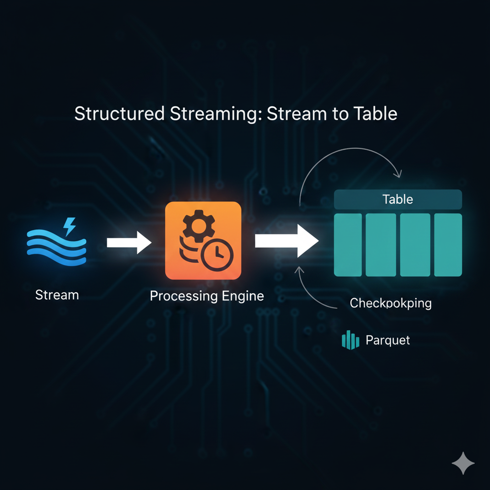

# 🚀 Real-Time Data Ingest: Kafka $\to$ Parquet Streaming



This template deploys a robust, fault-tolerant data pipeline using **Apache Spark Structured Streaming** to continuously ingest data from an Apache Kafka broker and write it to a highly optimized, partitioned **Parquet** data lake sink.

This template is designed to be easily reproducible on a **Saturn Cloud** instance, utilizing its pre-configured environment.

## Key Features

  * **Technology Stack:** PySpark 3.5.1, Spark Structured Streaming, Apache Kafka.
  * **Fault Tolerance:** Implements Spark **Checkpointing** for exactly-once processing guarantees.
  * **Data Optimization:** Writes data to the **Parquet columnar format** partitioned by `user_id` and `event_ts`.
  * **Local Simulation:** Includes full setup instructions for running a local Kafka broker for quick testing and development.

-----

## 1\. ⚙️ Environment Setup (Saturn Cloud Standard)

To run this pipeline, you need a single, consistent environment for the Spark driver and executors.

### A. System Dependencies (Saturn Cloud Environment)

Running on Saturn Cloud, you can use a base image that already has Java and Python installed. This template requires Python 3.8+ and Java 11/17+.

  * **Spark Binary:** We manually install Spark 3.5.1 to ensure the binary version matches the PySpark package.
  * **Kafka Binary:** We download the Kafka binary for running the local broker simulation.

How to download kafka:
Step 1: Get Kafka

Download the latest Kafka release and extract it: `https://www.apache.org/dyn/closer.cgi?path=/kafka/4.1.1/kafka_2.13-4.1.1.tgz`

```bash
$ tar -xzf kafka_2.13-4.1.1.tgz
$ cd kafka_2.13-4.1.1
```
#### Create vitual environment to control dependencies and installations
```bash
python -m venv kafka-env
source kafka-env/bin/activate

### B. Setup Script (`setup_env.sh`)

Create a script (or use a Saturn Cloud **initialization script**) to perform the one-time system and library setup.

```bash
# === setup_env.sh ===

# --- 1. Define Spark Variables (Targeting 3.5.1) ---
SPARK_VERSION="spark-3.5.1"
SPARK_ARCHIVE="${SPARK_VERSION}-bin-hadoop3.tgz"
INSTALL_PATH="/content/spark" # Installation Path

echo "--- 1. Downloading and installing Apache Spark 3.5.1 binary ---"
wget -q https://archive.apache.org/dist/spark/spark-3.5.1/$SPARK_ARCHIVE
tar -xzf $SPARK_ARCHIVE --no-same-owner
mv ${SPARK_VERSION}-bin-hadoop3 $INSTALL_PATH
rm $SPARK_ARCHIVE

# --- 2. Set Environment Variables ---
echo "--- 2. Setting environment variables ---"
export SPARK_HOME=$INSTALL_PATH
export PATH=$PATH:$SPARK_HOME/bin
export PYSPARK_PYTHON="/usr/bin/python3"

# --- 3. Install Python Dependencies ---
echo "--- 3. Installing PySpark 3.5.1 and supporting libraries ---"
pip install pyspark==3.5.1

echo "--- 4. Downloading Kafka Binary for Simulation ---"
KAFKA_BIN_VERSION="kafka_2.13-4.1.1"
wget -q https://archive.apache.org/dist/kafka/4.1.1/${KAFKA_BIN_VERSION}.tgz
tar -xzf ${KAFKA_BIN_VERSION}.tgz
rm ${KAFKA_BIN_VERSION}.tgz

echo "✅ Environment configured."
```

-----

## 2\. 💾 Pipeline Code

The core pipeline logic is stored in the `kafka_parquet_ingest.py` file (provided in previous steps). Ensure the output paths and Kafka topic name are defined:

```python
# --- Key Configuration Details in kafka_parquet_ingest.py ---
KAFKA_BROKERS = "localhost:9092"
KAFKA_TOPIC = "quickstart-events"
PARQUET_OUTPUT_PATH = "file:///tmp/data_lake/raw_events" 
CHECKPOINT_PATH = "file:///tmp/spark_checkpoints/kafka_events" 

# --- EVENT_SCHEMA for JSON Parsing ---
EVENT_SCHEMA = StructType([
    StructField("event_id", StringType(), True),
    StructField("user_id", IntegerType(), True),
    StructField("timestamp_str", StringType(), True),
    StructField("data_value", StringType(), True)
])
# ... (rest of the PySpark code)
```

-----

## 3\. 🏃 Execution Guide & Sequence

The entire process requires three separate terminal/shell sessions running concurrently.

### A. Session 1: Start the Kafka Broker (Server)

This session hosts the running Kafka server.

| Step | Command (Run from project root) | Purpose |
| :--- | :--- | :--- |
| **1. Navigate** | `cd kafka_2.13-4.1.1` | Enter the Kafka directory. |
| **2. Format** | `bin/kafka-storage.sh format --standalone -t $(bin/kafka-storage.sh random-uuid) -c config/server.properties` | Initializes the logs (Kraft mode). |
| **3. Start Server** | `bin/kafka-server-start.sh config/server.properties` | **Starts the Broker.** Look for the "Kafka Server started" message. |
| **4. Create Topic** | `bin/kafka-topics.sh --create --topic quickstart-events --bootstrap-server localhost:9092` | Creates the channel for the stream. (Will confirm if already exists). |

### B. Session 2: Start the PySpark Streaming Job

This session runs the main application logic, which connects to the server and begins the streaming query.

| Step | Command | Purpose |
| :--- | :--- | :--- |
| **1. Run Script** | `python kafka_parquet_ingest.py` | Executes the PySpark application. |
| **2. Wait** | The script will pause after logging `Streaming pipeline started...` | The pipeline is now running micro-batches every 30 seconds, waiting for data from Kafka. |

### C. Session 3: Produce Data (Test Input)

This session hosts the producer client, simulating new data arriving in real-time.

| Step | Command | Purpose |
| :--- | :--- | :--- |
| **1. Start Producer** | `kafka_2.13-4.1.1/bin/kafka-console-producer.sh --topic quickstart-events --bootstrap-server localhost:9092` | Launches the client and connects to the broker. |
| **2. Inject Data** | Paste the JSON lines one by one and press **Enter** after each: | Sends raw data into the Kafka topic. |
| | `{"event_id": "T1", "user_id": 101, "timestamp_str": "2025-11-28 13:00:00", "data_value": "app_open"}` | |
| | `{"event_id": "T2", "user_id": 102, "timestamp_str": "2025-11-28 13:00:30", "data_value": "page_view"}` | |

-----

## 4\. 📈 Verification and Cleanup

  * **Verification:** After 30 seconds, the PySpark terminal (Session 2) will log that a micro-batch was processed. You can confirm the result by listing the output directory: `ls /tmp/data_lake/raw_events/user_id=101/`.
  * **Cleanup:** To stop the job, press **Ctrl+C** in the PySpark terminal (Session 2). Then, press **Ctrl+C** in the Kafka Server terminal (Session 1).

## 💡 Saturn Cloud

This template is perfectly suited for **[Saturn Cloud](https://saturncloud.io)**, which simplifies the process of setting up Spark environments. By using Saturn Cloud, users can rapidly provision the necessary resources (compute, networking, storage) and focus entirely on the data pipeline logic, avoiding the manual setup steps detailed in this guide.

**Saturn Cloud** offers scalable Spark clusters and fully managed environments, allowing you to seamlessly transition this template from local simulation to production-grade data processing.