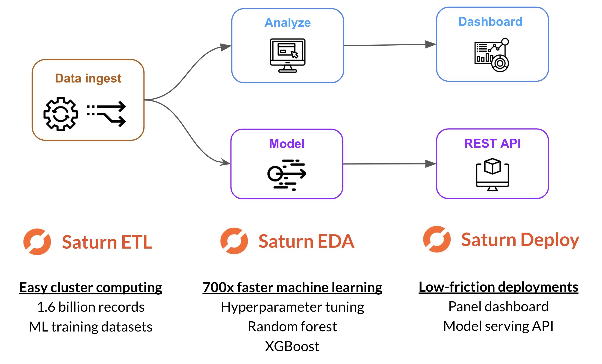
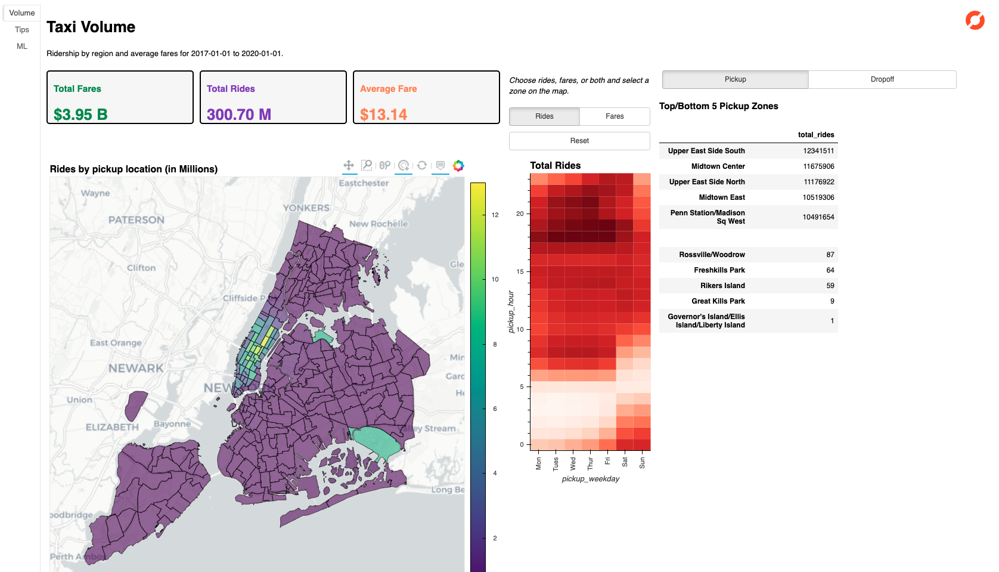

| | | |
| -- | -- | -- |

# NYC Taxi analysis with Saturn Cloud and Snowflake

The notebooks in this example showcase a data science workflow with NYC taxi data, executed on [Saturn Cloud](https://www.saturncloud.io/) with a database hosted in [Snowflake](https://www.snowflake.com/). For more information on how to connect to Snowflake using Saturn, Dask, and Pandas, refer to the `snowflake` example.

> **Note:** Running this example requires a Snowflake account. You can see how to set up a [free trial here](https://docs.snowflake.com/en/user-guide/admin-trial-account.html).

This example is a subset of a [larger demo](https://youtu.be/SgXSIbB4Hik), reduced to quickly highlight key features of Saturn Cloud and Snowflake together. The larger demo includes the following:



All code for the full demo is [available here](https://github.com/saturncloud/saturn-cloud-examples/tree/main/taxi_demo). You can follow the instructions there to create a new project and run the full examples. The example you are currently in is a reduced version to quickly (and cost-effectively) highlight key features of Saturn Cloud.

The notebooks in _this_ example cover:

1. Load records from CSV files into Snowflake (Snowflake SQL)
1. Create and deploy a dashboard with exploratory analysis (`holoviz`, `bokeh`, `panel`, `snowflake-connector-python`)
1. Train a number of machine learning models using single-node Python tools (`scikit-learn`, `xgboost`)
1. Use Dask to distribute and speed up model training (`dask-ml`, `dask-xgboost`)*
1. Deploy models via REST API (`flask`)

_\* These examples illustrate how to launch and utilize a Dask cluster with Saturn._

You are free to open each notebook in this example and start playing around! For a guided experience, follow the steps below.

## Load data into Snowflake

> **Note**: If you ran the `snowflake` example and already loaded the NYC taxi data into your Snowflake account, you can skip this step. This example uses the same data.

First step is to add your Snowflake credentials for notebooks in Saturn to access. To avoid setting credentials directly in notebooks, we recommend uploading credentials stored in a .yml file on the "Credentials page" in Saturn Cloud.

- Type: `File`
- Shared with: `<your username>`
- Path: /home/jovyan/snowflake_creds.yml
- Value: .yml file contents (below)

The .yml file can specify any arguments that can be passed to `snowflake.connector.connect`, such as:

```yaml
account: ...
user: ...
password: ...
role: ...
```

You will need to restart the Jupyter server if you add a Credential while its running. The examples utilize a warehouse called `COMPUTE_WH` at size `Medium`, but you can edit the paramemeters of `snowflake.connector.connect` in the notebooks if you want to use a different warehouse.

To load the data, open up a Worksheet inside of Snowflake and run the commands in the [`load-data.sql`](load-data.sql) file.

## Dashboard

The dashboard presents summary statistics about NYC taxi rides from the years 2017 through 2019. Plots are built with [HoloViz](https://holoviz.org/) and [Bokeh](https://bokeh.org/), and the dashboard is served using [Panel](https://panel.holoviz.org/). Any other Python visualization or dashboard library is supported by Saturn; this is just one example.



The dashboard queries the Snowflake database and pulls the data into Pandas. See [`dashboard.ipynb`](dashboard.ipynb) for the dashboard code. 

### Running dashboard

If you run all the cells in the notebook, the final cell will display the dashboard inline.

To run it as a separate process from JupyterLab: open a terminal, then cd into the dashboard directory and run `panel serve`:

```bash
panel serve /home/jovyan/project/examples/nyc-taxi/dashboard.ipynb
```

The dashboard will be live behind the Jupyter proxy. You can copy the URL of this Jupyter window and replace `/lab/*` with `/proxy/5006/dashboard`. For example, your Jupyter URL might be:

> https://main.demo.saturnenterprise.io/user/aaron/examples-cpu/lab/workspaces/examples-cpu

Then your dashboard URL would be: 

> https://main.demo.saturnenterprise.io/user/aaron/examples-cpu/proxy/5006/dashboard

It will take a few seconds to load when first viewing the page, as all the cells in this notebook must be executed first.

#### Deployment 

To run as part of a persistent Deployment, go to the "Deployments" page in Saturn Cloud and create a new deployment. This will host the dashboard so users can view it without having to launch a Jupyter project. Note that Deployment names must be unique across all users.

- Name: Any name you like, for example: `<USERNAME>-taxi-dashboard`
- Project: `examples-cpu`
- Command: (see below)
- Instance Count: 1
- Instance Size: Medium - 2 cores - 4 GB RAM

The command is:

```bash
python -m panel serve /home/jovyan/project/examples/nyc-taxi/dashboard.ipynb --port=8000 --address="0.0.0.0" --allow-websocket-origin="*"
```

After you create the Deployment, click the play button to start it up. It will take a few minutes to launch the deployment, then when its up you can view the dashboard at the URL listed on the Deployment card. You can view logs by clicking on the Status link.

Note that the "Predict my Tip" widget on the "ML" tab will return `-1.00%` until we specify a model deployment for it to point to. We will get there later in the example.

## Train ML models

Several examples of machine learning model training are included. With each, we include a "traditional" Python version (single-node on CPU) and a synonymous version accelerated by parallel and/or GPU computing.

| ML task                                 | Traditional  | Accelerated               |
|------------------------------------------------|--------------|---------------------------|
| Hyperparamer tuning + Elastic net   regression | `scikit-learn` | `dask-ml` (CPU cluster)    |
| XGBoost regression                             | `xgboost`      | `dask-xgboost` (CPU cluster)              |
| Random forest classification                   | `scikit-learn` | `cuml` (GPU)<br>`cuml.dask` (GPU cluster) |

### Hyperparameter tuning

In this example we use data that fits comfortably in memory and train a model that does not require intense compute. Scale problems arise when we introduce a large hyperparameter grid to search over. This becomes a compute-bound problem because we need to train a large number of models, but the data is small. `dask-ml` saves the day when it comes to [hyperparameter tuning with large grids](https://youtu.be/zKky9e9nc0E), because we can parallelize our grid search across a cluster rather than just the processes in our single node.

We will use `dask-ml`'s [drop-in replacement for `GridSearchCV`](https://ml.dask.org/hyper-parameter-search.html#drop-in-replacements-for-scikit-learn) to scale the parameter search. Not only can we take advantage of more processes for model fitting, but `dask-ml`'s grid search [avoids repeating expensive pre-processing steps](https://ml.dask.org/hyper-parameter-search.html#avoid-repeated-work) in the pipeline.

Ready to dive in? Run these two notebooks in order:

1. [`hyperparameter-scikit.ipynb`](hyperparameter-scikit.ipynb): single-node scikit version - takes a while 🙁
1. [`hyperparameter-dask.ipynb`](hyperparameter-dask.ipynb): distributed Dask version - super fast! ⚡️

For the best experience, we recommend opening up both notebooks side-by-side in JupyterLab. That way you can see which lines of code change when we use Dask (spoiler: not many!). To monitor resource utilization of your Jupyter client, open a new Terminal window and run `htop`. To monitor resource utilization of a Dask cluster, click the "Dashboard" link in the cell output when you initialize the cluster.

### XGBoost regression

The XGBoost notebooks are an example of using Dask to distribute a single model fit across a cluster. The hero in this story is an [integration between Dask and XGBoost](https://examples.dask.org/machine-learning/xgboost.html) from the `dask-xgboost` package. `dask-xgboost` sets up XGBoost master and worker processes on the Dask cluster's scheduler and workers, respectively. This allows for scaling to more cores than what would be available in a single node with `xgboost` alone.

As with the hyperparameter example, there are two notebooks that you can run and examine side-by-side:

1. [`xgboost.ipynb`](xgboost.ipynb): single-node XGBoost version 💡
1. [`xgboost-dask.ipynb`](xgboost-dask.ipynb): distributed Dask version 💥

You'll notice that there is not much code to change here beyond launching the Dask cluster with Saturn and importing `dask_xgboost` instead of `xgboost`. There is a modest performance gain from distributing training because we're using a small cluster; with a larger cluster there would more dramatic speedups.

### Random forest classification

The random forest examples showcase GPU-accelerated model training with [RAPIDS](http://rapids.ai/). This requires a separate project running on a GPU instance and image. Jump over to the `examples-gpu` project on your Jupyter page for these examples.

## Serve ML model

An example `flask` app to serve a model REST API is in [`model-api.py`](model-api.py). This script pulls down a trained model from Saturn's public S3 bucket and hosts an endpoint for model predictions.

To test the REST API from JupyterLab, open a new Terminal window and run the following to start up the app:

```bash
python /home/jovyan/project/examples/nyc-taxi/model-api.py
```

Open another Terminal window to get a prediction from the API:

```bash
curl -X POST \
    http://0.0.0.0:8000/api/predict \
    -d '{"passenger_count": 1, "tpep_pickup_datetime": "2019-01-01T11:15:38Z", "PULocationID": 37, "DOLocationID": 215}'
```

### Deployment 

To run as part of a persistent Deployment, go to the "Deployments" page in Saturn Cloud and create a new deployment. This will host the API so apps can get predictions from the model.

- Name: Any name you like, for example: `<USERNAME>-taxi-model`
- Project: `examples-cpu`
- Command: (see below)
- Instance Count: 1
- Instance Size: Medium - 2 cores - 4 GB RAM

The command is:

```bash
python /home/jovyan/project/examples/nyc-taxi/model-api.py
```

After you create the Deployment, click the play button to start it up. It will take a few minutes to launch the deployment, then when its up you can hit the API from a Jupyter client in Saturn using the URL listed:

```bash
DEPLOYMENT_URL='<URL from Deployment>'
curl -X POST \
    http://${DEPLOYMENT_URL}:8000/api/predict \
    -d '{"passenger_count": 1, "tpep_pickup_datetime": "2019-01-01T11:15:38Z", "PULocationID": 37, "DOLocationID": 215}'
```


### Hook up to dashboard

To get the "Predict my tip" widget in the dashboard to use the deployed model, a `MODEL_URL` environment variable should point to the URL from the model Deployment. You can set it when running the dashboard from JupyterLab:

```bash
export MODEL_URL='<URL from Deployment>'
panel serve /home/jovyan/project/examples/nyc-taxi/dashboard.ipynb
```

For the persistent dashboard, edit the dashboard Deployment we set up earlier to set the environment variable. In the Environment Variables section, add:

```bash
MODEL_URL='<URL from Deployment>'
```

Check out [this part of the `dashboard.ipynb` notebook](dashboard.ipynb#ML-Tab) that hits the endpoint using the `requests` package.

# That's all folks

Thanks for following along! We encourage you to continue to play around with these examples and use the code for your own work. There is a much [larger version of NYC taxi analysis](https://github.com/saturncloud/saturn-cloud-examples/tree/main/taxi_demo) that you can clone into a new project and see more of the power of Dask+RAPIDS on Saturn Cloud.

If you have any issue with Saturn Cloud, please email us at support@saturncloud.io. If you notice any mistakes in these notebooks or documentation, [open an issue](https://github.com/saturncloud/examples/issues) or a [a pull request](https://github.com/saturncloud/examples/pulls).

## References

- NYC taxi image by [David Hurley on Unsplash](https://unsplash.com/photos/aPlUUmO4qr8).
