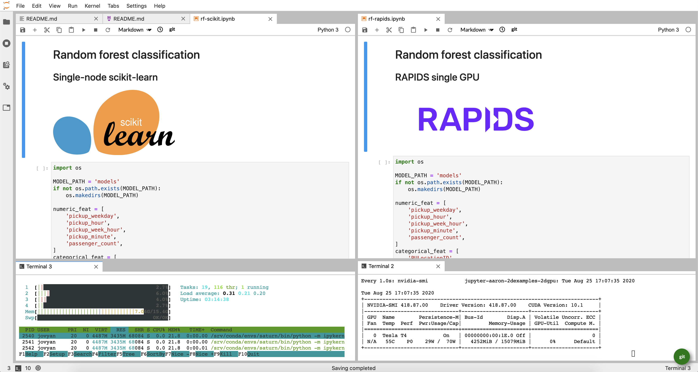
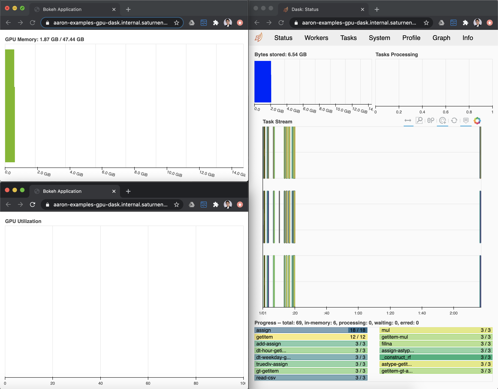

| | |
| -- | -- |

# NYC Taxi analysis with Saturn Cloud

The notebooks in this example showcase a data science workflow with NYC taxi data, executed on [Saturn Cloud](https://www.saturncloud.io/). They are a subset of a [larger demo](https://youtu.be/SgXSIbB4Hik), reduced to quickly highlight key features of Saturn Cloud. The larger demo includes the following:


All code for the full demo is [available here](https://github.com/saturncloud/saturn-cloud-examples/tree/main/taxi_demo). You can follow the instructions there to create a new project and run the full examples. The example you are currently in is a reduced version to quickly (and cost-effectively) highlight key features of Saturn Cloud.

You are currently viewing the **GPU** project for the NYC taxi examples, which covers GPU-accelerated machine learning with RAPIDS. For all other examples, go to the `examples-cpu` project. 

The notebooks in _this_ example cover:

1. Train a random forest classifier using single-node Python (`scikit-learn`)
1. Accelerate random forest training on a GPU with RAPIDS (`cudf`, `cuml`)
1. Distribute the random forest training on a GPU cluster (`dask_cudf`, `cuml.dask`)

You are free to open each notebook in this example and start playing around! For a guided experience, follow the steps below.

## Train ML models

### Random forest classification

Ready to dive in? Run these notebooks in order:

1. [`rf-scikit.ipynb`](rf-scikit.ipynb): single-node scikit version - takes a while 🙁
1. [`rf-rapids.ipynb`](rf-rapids.ipynb): single-GPU RAPIDS version - super fast! 🤯
1. [`rf-rapids-dask.ipynb`](rf-rapids-dask.ipynb): multi-GPU Dask+RAPIDS version - _extra_ super fast! 🤯🤯🤯

For the best experience, we recommend opening up two notebooks at a time side-by-side in JupyterLab. That way you can see which lines of the code change between them (spoiler: not many!). There are a few different resources to monitor to see what's happening:

- **CPU utilization of Jupyter client** for scikit-learn example: open a new Terminal window and run `htop`. 
- **GPU utilization of Jupyter client** for RAPIDS example: open a new Terminal window and run:

    ```watch -n 1 nvidia-smi```
    
- **GPU cluster utilization** for Dask+RAPIDS example: click the dashboard and GPU monitoring links provided in the notebook.

Here what this might look like in JupyterLab:

[](img/workspace.png)

And then another browser window for Dask cluster monitoring:

[](img/dask.png)