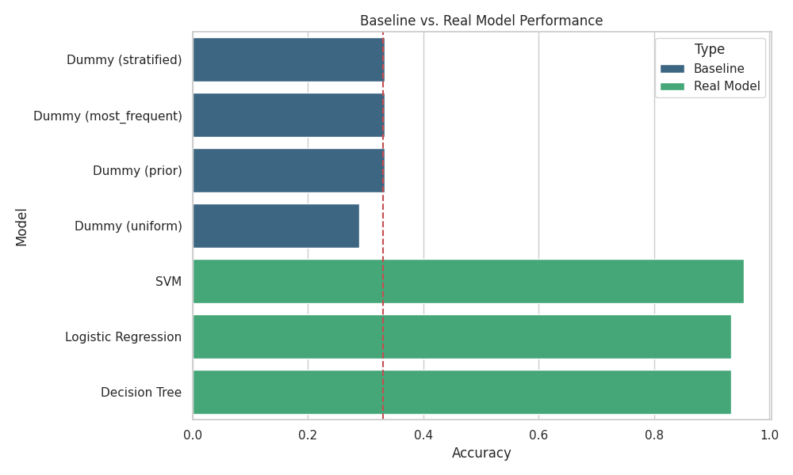

# scikit-learn GBM (Python Server)

<div align="center">
  
</div>

This template implements a production-ready **Baseline Model Comparison** workflow using **scikit-learn** on a **Python Server**. It demonstrates two core server capabilities:
1.  **Batch Processing**: A script to train a model and generate static reports (headless plotting).
2.  **API Service**: A FastAPI server to serve real-time predictions from the trained model.

**Infrastructure:** [Saturn Cloud](https://saturncloud.io/)
**Resource:** Python Server
**Hardware:** CPU
**Tech Stack:** scikit-learn, FastAPI, Pandas, Seaborn

---

## 🚀 Quick Start

### 1. Environment Setup
Run the setup script to automatically create the Python virtual environment (`venv`) and install all required dependencies (including FastAPI and scikit-learn).

```bash
# 1. Make the script executable (if needed)
chmod +x setup.sh

# 2. Run the setup
bash setup.sh

```

### 2. Train the Model (Batch Job)

Run the baseline script. This performs the following actions:

* Loads the Iris dataset.
* Trains multiple models (Dummy, SVM, Logistic Regression, Decision Tree).
* **Saves the Model:** Exports the trained Logistic Regression model to `iris_model.pkl`.
* **Saves the Report:** Generates a performance plot (`baseline_comparison.png`) without requiring a display monitor.

```bash
# Activate the environment
source venv/bin/activate

# Run the training pipeline
python baseline.py

```

### 3. Start the API Server

Once the model is trained and saved, start the **FastAPI** server to begin accepting prediction requests.

```bash
# Start the server (runs on port 8000)
python app.py

```

---

## 🧠 Project Architecture

### Files Included

* **`setup.sh`**: Robust setup script that handles virtual environment creation and dependency installation.
* **`baseline.py`**: The "Batch" workload. It compares model performance against a baseline and saves artifacts (model + plots) to disk.
* **`app.py`**: The "Service" workload. A FastAPI application that loads `iris_model.pkl` and serves an HTTP endpoint for predictions.

### Model Details

* **Baseline Strategy**: Uses a "Dummy Classifier" to establish minimum acceptable accuracy.
* **Production Model**: A **Logistic Regression** classifier is selected for deployment due to its efficiency and interpretability.

---

## 🧪 Testing & Validation

You can interact with this template in two ways:

### A. Check Batch Results

After running `baseline.py`, verify that the artifacts were created:

```bash
# Check for the plot and the saved model
ls -lh baseline_comparison.png iris_model.pkl

```

### B. Test the API (Web Interface)

While `python app.py` is running, open your browser to the auto-generated documentation:

* **URL:** `http://localhost:8000/docs`
* **Action:** Click **POST /predict** -> **Try it out** -> **Execute**.

### C. Test the API (Terminal)

You can also send a raw HTTP request from a separate terminal window:

```bash
curl -X 'POST' \
  'http://localhost:8000/predict' \
  -H 'Content-Type: application/json' \
  -d '{
  "sepal_length": 5.1,
  "sepal_width": 3.5,
  "petal_length": 1.4,
  "petal_width": 0.2
}'

```

**Expected Output:**

```json
{"class_id":0,"class_name":"setosa"}

```

---

## 🏁 Conclusion

This template provides a robust foundation for deploying machine learning models on CPU-based Python Servers. By separating the **training pipeline** (`baseline.py`) from the **inference service** (`app.py`), it adheres to MLOps best practices, ensuring that model artifacts are versioned and reproducible.

For scaling this workflow to larger datasets or deploying it to a managed cluster, consider moving this pipeline to [Saturn Cloud](https://saturncloud.io/). Use this structure as a starting point to deploy more complex models, such as Random Forests or Gradient Boosting Machines, while maintaining a clean and scalable deployment architecture.

