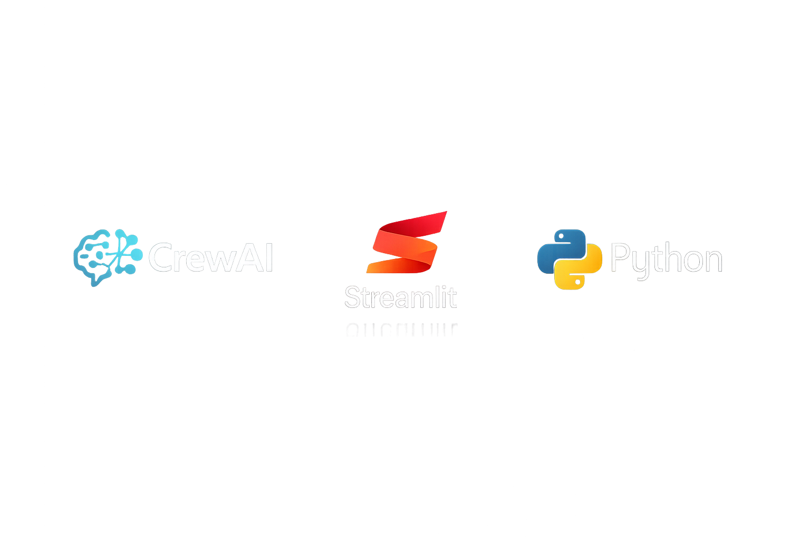

## CrewAI Research Crew (CPU/GPU)



This template provides a technical implementation of a **multi-agent research architecture** using the CrewAI framework. It demonstrates an automated pipeline where specialized agents coordinate to perform information retrieval, data synthesis, and technical reporting.

**Infrastructure:** [Saturn Cloud](https://saturncloud.io/)
**Resource:** Python Project
**Hardware:** CPU/GPU
**Tech Stack:** CrewAI, Streamlit, Python

---

## 📖 Overview

This template implements a **Multi-agent research team** designed to handle complex information-gathering tasks. By delegating roles to autonomous agents, the system reduces the context window limitations and hallucination risks associated with single-prompt LLM interactions.

The implementation includes:

1. **Researcher Agent:** Configured for information gathering and technical data extraction.
2. **Writer Agent:** Optimized for synthesizing raw research into structured Markdown reports.
3. **Orchestration:** A sequential process flow managed via the CrewAI project container.
4. **Interactive Dashboard:** A Streamlit interface for real-time monitoring of agent "thinking" and process execution.

---

## 🚀 Execution Guide

### 1. Environment Initialization

The workflow requires a virtual environment to ensure dependency isolation and a stable execution context.

1. **Create and Activate Virtual Environment:**
```bash
python -m venv venv
source venv/bin/activate  # Windows: .\venv\Scripts\activate

```


2. **Install Dependencies:**
```bash
pip install -r requirements.txt

```


### 2. Configuration

The application requires an `OPENAI_API_KEY` to facilitate LLM-based reasoning.

1. Create a `.env` file in the root directory.
2. Define the following variables:
```bash
OPENAI_API_KEY=sk-your-key-here
OTEL_SDK_DISABLED=true        # Disables telemetry for thread safety in Streamlit
CREWAI_TELEMETRY_OPT_OUT=true # Opts out of telemetry signals

```


### 3. Launching the Dashboard

To trigger the multi-agent workflow via the web interface:

```bash
streamlit run src/app.py --server.port 8000 --server.address 0.0.0.0

```

---

## 🧠 Technical Architecture

The system is structured to separate agent logic from the presentation layer.

### 1. Configuration Layer (`/config`)

* **`agents.yaml`**: Defines the role, goal, and backstory for each agent.
* **`tasks.yaml`**: Defines specific task descriptions, expected outputs, and agent assignments.

### 2. Core Logic (`src/crew.py`)

This file uses the `@CrewBase` decorator to assemble the crew. It utilizes absolute path resolution to ensure configuration files are located correctly regardless of the execution entry point.

### 3. Presentation Layer (`src/app.py`)

The Streamlit dashboard handles:

* **State Management:** Checks for API keys in `.env` before prompting the user.
* **Process Visualization:** Implements `st.status` and `st.expander` to display the intermediate "thinking" steps of the agents during execution.

---

## 🏁 Conclusion

This implementation demonstrates a production-ready approach to multi-agent systems on Saturn Cloud. It provides a modular framework that can be scaled by adding custom tools or expanding the agent pool.

To scale this deployment—such as integrating with a persistent database or exposing a REST API—consider utilizing the Saturn Cloud Deployment resources to host the Streamlit dashboard as a persistent service.